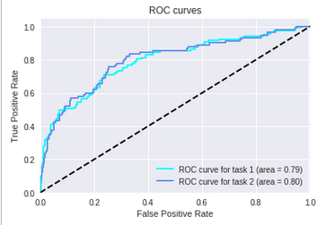

# Dermatologist-AI

The goal of this mini-project (from [Udacity](http://wwww.udacity.com))  is to build a deep learning model that helps to diagnose melanoma. It will distinguish this malignant skin tumor from two types of benign lesions:
- [Begnign nevus](http://missinglink.ucsf.edu/lm/dermatologyglossary/nevus.html)
- [seborrheic keratoses](https://www.aad.org/public/diseases/bumps-and-growths/seborrheic-keratoses)


## Model 
Inception v3 using PyTorch as Framework.

## Evaluation
The model is ranked according to three separate categories:
- Category 1 (Score 1): ROC AUC for melanoma classification.
> This is the ability to distiguish  between malignant melanoma and the benign skin lesions (nevus, seborrheic keratosis) by calculating the area under the receiver operating characteristic curve ([ROC AUC](http://scikit-learn.org/stable/modules/generated/sklearn.metrics.roc_auc_score.html)) corresponding to this binary classification task.

- Category 2 (Score 2): ROC AUC for melanocytic classification: 
> All of the skin lesions that we will examine are caused by abnormal growth of either melanocytes or keratinocytes, which are two different types of epidermal skin cells. Melanomas and nevi are derived from melanocytes, whereas seborrheic keratoses are derived from keratinocytes. The second caterory tests the ability to distinguish between melanocytic and keratinocytic skin lesions.

- Category 3 (Score 3): Mean ROC AUC:
> This catefory take the average of the ROC AUC values from the first two categories.

## Results 

### Scores 
```
Category 1 Score: 0.792
Category 2 Score: 0.798
Category 3 Score: 0.795
```

### ROC curves

